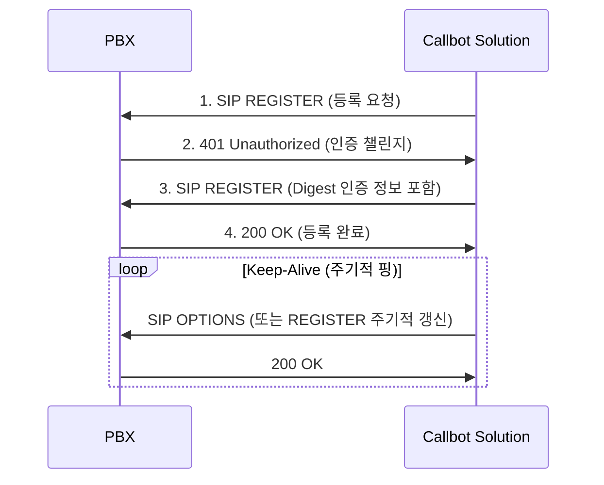
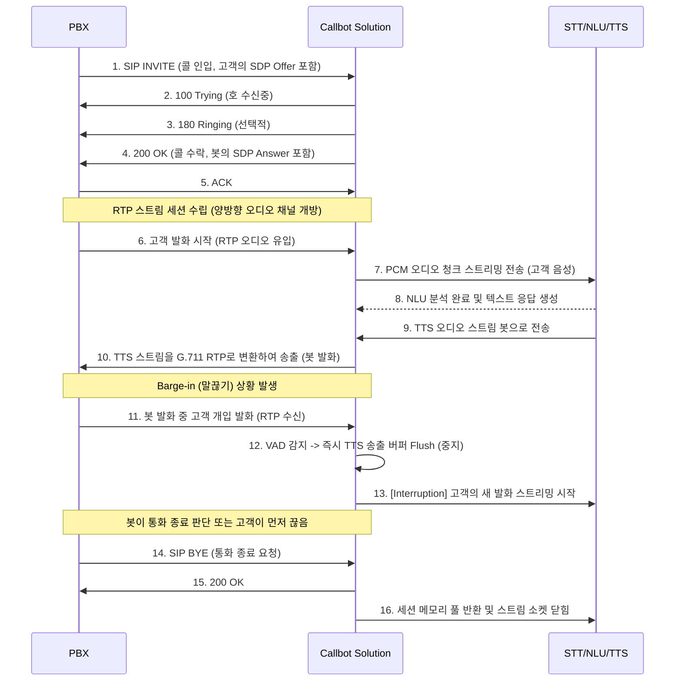

# AI 콜봇(Voicebot) 인프라 연동 솔루션 아키텍처 설계서

## 1. 개요 (Overview)
본 문서는 고객의 전화를 받아(PBX/SBC 연동) 음성을 인식(STT)하고, 의도를 파악(NLU)하여, 적절한 답변을 음성으로 송출(TTS)하는 **AI 콜봇 서비스의 핵심 '통화 제어 및 미디어 게이트웨이(Voice Gateway)' 솔루션** 설계서입니다. 

순수 시그널링(SIP) 제어뿐만 아니라, **실시간 RTP(음성 패킷) 스트리밍 처리가 아키텍처의 가장 중요한 핵심**이 됩니다.

## 2. 최적화 도서관(Library) 재검토 및 최종 선정 (Technology Stack)

콜봇 게이트웨이는 일반 PBX와 달리 **"수천 건의 SIP 시그널링 유지 + 실시간 양방향 RTP 미디어 트랜스코딩 + 방대한 AI 오디오 스트리밍"**이라는 극한의 I/O 부하를 견뎌야 합니다. 이를 위해 엄격히 검토하여 선정한 **최상위 최적화 C/C++ 라이브러리 스택**은 다음과 같습니다.

### 2.1 SIP & Media Core: PJSIP (C로 작성, C++ 지원) 🏆
*   **선정 이유:** 트래픽 라우팅에 특화된 Kamailio나, 무거운 다목적 스위치인 FreeSWITCH에 비해 **"직접 만든 C++ 서버 안에서 오디오 프레임(PCM 버퍼)을 마이크로초 단위로 주입/추출하기 가장 가볍고 정교한 API"**를 제공합니다. 
*   **특장점:** VAD(Voice Activity Detection), Adaptive Jitter Buffer, G.711(PCMA/PCMU) 인코딩/디코딩 모듈이 C 레벨로 강력하게 최적화되어 내장되어 있으므로 콜봇용 미디어 핸들링의 표준입니다.

### 2.2 비동기 I/O 및 멀티스레드 제어: Boost.Asio (C++17/20) 🏆
*   **선정 이유:** 콜봇은 네트워킹의 집합체입니다. 수많은 소켓 연결(내부 API용 TCP/WS, 기타 통신)과 워커 스레드 관리, 타이머(타임아웃 처리)를 블로킹 락(Lock) 없이 구현해야 합니다. 리눅스의 `epoll`과 Mac의 `kqueue`를 추상화한 **Boost.Asio**는 스레드 컨텍스트 스위칭 지연을 가장 완벽하게 제거해주는 C++ 비동기 네트워킹의 De facto(사실상 표준)입니다.

### 2.3 AI 오디오 스트리밍 프로토콜: gRPC (C++ & Protocol Buffers) 🏆
*   **선정 이유:** 양방향으로 20ms 간격으로 잘게 쪼개진 오디오 바이너리를 STT/TTS 엔진으로 전달해야 합니다. REST API나 일반 WebSocket을 썼을 때 발생하는 HTTP 헤더 오버헤드를, HTTP/2 기반의 **gRPC Bi-directional Streaming**이 드라마틱하게 줄여줍니다. 처리량 면에서 경쟁 기술보다 최고 10배 빠릅니다.

### 2.4 오디오 리샘플링: SpeexDSP 🏆
*   **선정 이유:** PBX 전화망은 8kHz 해상도를 쓰고 AI 엔진(STT/TTS)은 보통 16kHz~24kHz를 요구하므로 초당 수만 단위의 "리샘플링" 연산 병목이 발생합니다. C 기반으로 SIMD(단일 명령 다중 데이터 처리) 최적화가 되어있는 **SpeexDSP** 라이브러리가 콜봇의 실시간 리샘플링 연산에 가장 적합합니다.

### 2.5 빌드 환경 및 스크립팅: CMake + Ninja
*   **선정 이유:** PJSIP, gRPC, Boost와 같은 초대형 라이브러리의 의존성을 맥(Mac) 개발 환경과 리눅스 배포 환경에서 동일하게 유지/빌드할 수 있는 유일한 시스템입니다. 빌드 생성기는 5배 빠른 Ninja를 도입해 개발 생산성을 올립니다.

## 3. 콜봇 특화 시스템 아키텍처 (System Architecture)

```mermaid
graph TD
    %% 사용자 및 전화망
    User[고객 📱] <--> |Voice| PBX[PBX / SBC]
    
    %% 콜봇 게이트웨이 (이번에 개발할 C++ 솔루션)
    subgraph Callbot Gateway [Callbot Infrastructure Solution (C++)]
        SIP_End[SIP Endpoint]
        Media_Port[RTP Media Port / Jitter Buffer]
        Orchestrator[Dialog & Session Orchestrator]
        AI_Connector[AI Stream Connector (gRPC/WS)]
        
        SIP_End <--> |제어| Orchestrator
        Orchestrator <--> |제어| Media_Port
        Media_Port <--> |PCM Audio| AI_Connector
    end
    
    PBX <--> |SIP| SIP_End
    PBX <--> |RTP (G.711)| Media_Port
    
    %% AI 백엔드 엔진
    subgraph AI Engines
        STT[STT Engine (음성인식)]
        NLU[NLU Engine (자연어이해)]
        TTS[TTS Engine (음성합성)]
        
        STT --> |Text| NLU
        NLU --> |Text| TTS
    end
    
    AI_Connector --> |1. Audio Stream (Tx)| STT
    TTS --> |2. Audio Stream (Rx)| AI_Connector
```

## 4. 핵심 컴포넌트 동작 방식 (Core Components)

### 4.1 SIP Endpoint (세션 관리)
*   **역할:** PBX로부터 들어오는 `INVITE` 콜을 수락하고(Answer), 통화 종료(`BYE`) 시 세션을 정리합니다. 콜봇 솔루션 자체가 하나의 전화기(User Agent)처럼 동작합니다.

### 4.2 RTP Media Port & Transcoder (미디어 브릿지)
*   **역할:** 콜봇의 핵심 컴포넌트입니다.
    1.  **Rx (수신):** PBX에서 들어오는 RTP 패킷(보통 G.711 8kHz)을 디코딩하여 원시 오디오 형태(PCM 16kHz 등 AI 엔진이 요구하는 포맷)로 변환합니다.
    2.  **Tx (송신):** TTS로부터 받은 오디오 스트림(PCM)을 다시 G.711 RTP 패킷으로 인코딩하여 PBX로 송출합니다.
    3.  **VAD (Voice Activity Detection):** 고객이 말하기 시작하는 시점과 끝나는 시점을 감지하여 STT 엔진의 부하를 줄이고 턴(Turn)을 관리합니다.

### 4.3 AI Stream Connector (STT/TTS 연동 스레드)
*   **역할:** 변환된 오디오 프레임 버퍼를 일정 크기(예: 20ms 단위)로 쪼개어 gRPC나 WebSocket을 통해 STT로 실시간 스트리밍합니다. 동시에 TTS 스트림이 내려오면 콜 세션의 재생 버퍼(Media Playback Buffer)에 밀어 넣습니다.

### 4.4 Dialog Orchestrator (대화 흐름 제어)
*   **Barge-in (말끊기) 제어:** 콜봇이 말을 하는 도중(TTS 재생 중) 사용자가 말을 시작하면(VAD 감지), 즉시 TTS 재생을 중단(RTP 송출 중단)하고 사용자의 말을 STT로 보내는 고도화된 타겟팅 로직을 제어합니다.

## 5. 통화 인프라 연동 및 실시간 콜 흐름 (Call Flow)

### 5.1 콜봇 서버 등록 (Registration Flow)
콜봇 솔루션이 구동되면 가장 먼저 PBX에 자신을 내선 번호(Extension) 또는 트렁크(Trunk)로 등록해야 합니다.



### 5.2 인바운드 콜 처리 및 AI 연동 흐름 (Inbound Call Flow)
등록된 콜봇(내선)으로 고객 호가 인입될 때의 흐름과 통화 종료 처리입니다.



## 6. 특화 성능 및 고려사항 (Technical Considerations)

1.  **Jitter Buffer 최적화:** 네트워크 환경에 따라 RTP 패킷의 순서가 섞이거나 지연될 수 있습니다. 너무 큰 버퍼는 봇의 반응 속도(응답 지연)를 늦추고, 너무 짧으면 오디오가 깨집니다. 동적 지터 버퍼(Adaptive Jitter Buffer) 튜닝이 필수적입니다.
2.  **오디오 포맷 변환 부하 (Resampling):** 전화망의 8kHz G.711과 AI 엔진이 요구하는 16kHz PCM 간의 리샘플링 작업이 매 20ms마다 발생하므로, C++ 기반의 고속 리샘플링 라이브러리(SpeexDSP 등) 활용이 필요합니다.
3.  **동시성 처리 (Concurrency):** 채널(콜) 1개당 Rx, Tx 두 방향의 미디어 스트림이 처리되어야 합니다. 수백 채널을 하나의 서버에서 처리하기 위해 Boost.Asio 기반의 비동기 전송 계층 설계가 핵심입니다.
